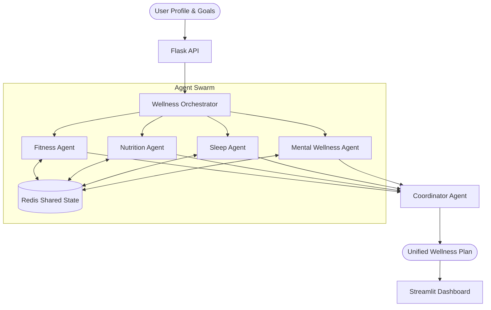

# WellSync AI - Autonomous Multi-Agent Wellness Orchestrator 🧠💪🥗

> **Hackathon Submission**: A fully autonomous wellness system powered by **Swarms AI** and **Google Gemini/OpenAI**.

WellSync AI is a multi-agent system that generates hyper-personalized wellness plans by orchestrating four domain-specific AI agents: **Fitness**, **Nutrition**, **Sleep**, and **Mental Wellness**. These agents collaborate, debate, and resolve conflicts (e.g., "High intensity workout" vs "Poor sleep recovery") to produce a unified, scientifically grounded lifestyle plan.

---

## 🏗️ Architecture

The system follows a **Shared State Orchestration** pattern:



## 🚀 Features

-   **Multi-Agent Collaboration**: Agents share context (e.g., Nutrition Agent knows you did a heavy workout and suggests more protein).
-   **Conflict Resolution**: The Coordinator Agent detects and resolves contradictions (e.g., "Don't schedule a 5am run if the user slept 4 hours").
-   **Platform Agnostic LLM**: Supports **Google Gemini** (Free Tier) and **OpenAI GPT-4**.
-   **Resilient Infrastructure**: Redis for state management with automatic in-memory fallback.
-   **High Performance**: Parallel agent execution and semantic caching for <3s response times.
-   **Proactive UI**: Glassmorphism-based Streamlit interface with real-time agent activity visualization.

---

## 🛠️ Setup Guide

### Prerequisites
-   Python 3.10+
-   Redis (Optional, but recommended. System runs in memory mode without it).
-   API Key: **Google Gemini API Key** (Free) or **OpenAI API Key**.

### 1. Installation

```bash
# Clone the repository
git clone https://github.com/Xombi17/innov-ai-hackathon-swarms.git
cd innov-ai-hackathon-swarms

# Create virtual environment
python -m venv venv
# Windows
venv\Scripts\activate
# Linux/Mac
source venv/bin/activate

# Install dependencies
pip install -r requirements.txt
```

### 2. Configuration

Create a `.env` file in the root directory:

```bash
# .env
LLM_PROVIDER=gemini
LLM_MODEL=gemini/gemini-3-flash-preview
GEMINI_API_KEY=your_gemini_key_here

# Supabase Cloud Backend (Optional - Replaces Local SQLite)
SUPABASE_URL=https://xvhndmsndogkvpwuemzl.supabase.co
SUPABASE_KEY=your_supabase_anon_or_service_key

# Optional: SQLite DB (Fallback if Supabase is not configured)
DATABASE_URL=sqlite:///data/databases/wellsync.db
```

### 3. Initialize Database

Run the database initialization script:
```bash
python init_db.py
```

---

## 🏃‍♂️ Usage

### 1. Start the Backend API
The core intelligence lives in the Flask API.

```bash
python run_api.py
```
*API will start on `http://localhost:5000`*

### 2. Start the User Interface
Open a new terminal and launch the Streamlit dashboard.

```bash
streamlit run wellsync_ai/ui/Home.py
```
*UI will open in your browser.*

---

## 📂 Project Structure

-   `wellsync_ai/agents/`: Core logic for all 5 agents (Base, Fitness, Nutrition, Sleep, Mental, Coordinator).
-   `wellsync_ai/workflows/`: Orchestration logic managing the agent lifecycle.
-   `wellsync_ai/api/`: Flask API endpoints.
-   `wellsync_ai/data/`: Database models and Redis/Memory managers.
-   `wellsync_ai/ui/`: Streamlit frontend application.
-   `legacy/`: Old prototypes and experiments (kept for reference).

---

## 🧪 Testing

To test the connectivity without the UI:
```bash
# PowerShell
Invoke-RestMethod -Method POST -Uri "http://localhost:5000/wellness-plan" -Body '{"user_id": "test"}' -ContentType "application/json"
```

---

**Built with ❤️ for Innovation Hackathon**